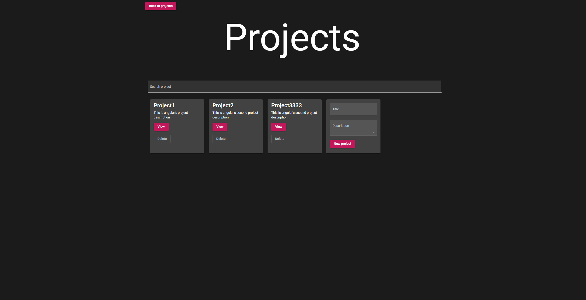
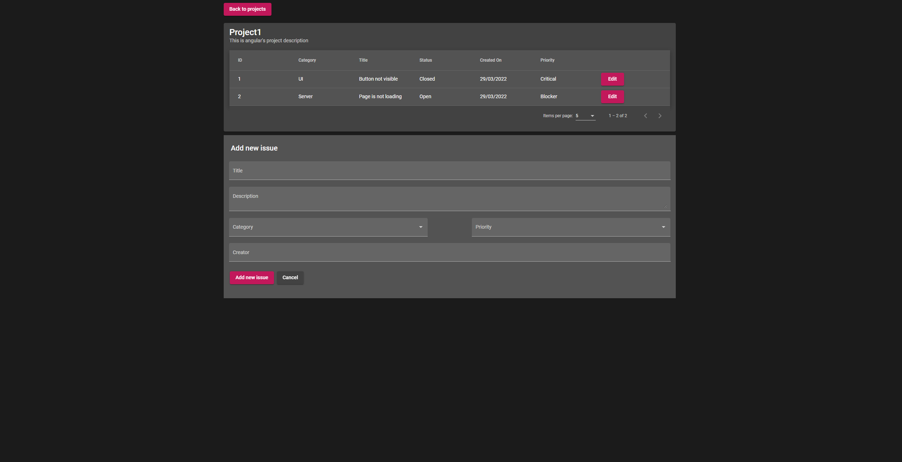
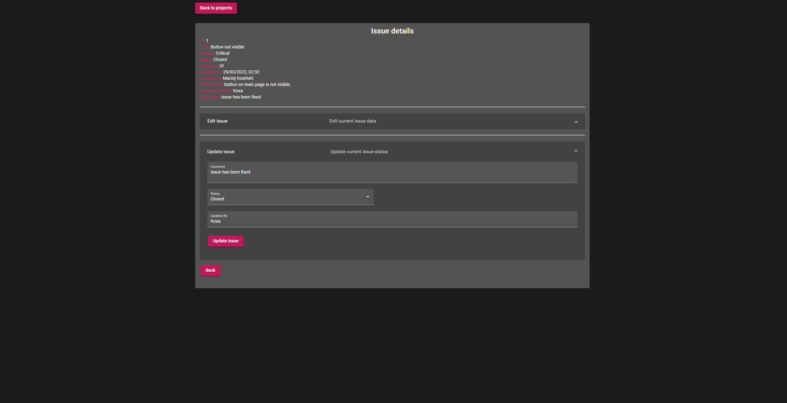

# Bug Tracker
> Bug tracker for multuple projects

## Table of Contents
* [General Info](#general-information)
* [Technologies Used](#technologies-used)
* [Features](#features)
* [Screenshots](#screenshots)
* [Setup](#setup)
* [Usage](#usage)
* [Project Status](#project-status)
* [Room for Improvement](#room-for-improvement)
* [Contact](#contact)
<!-- * [License](#license) -->

## General Information
The purpose of this project is to test my Angular abilities and solve the problem of tracking issues in multiple projects.

## Technologies Used
- Angular CLI: 13.2.6
- Node: 16.13.0
- Package Manager: npm 8.1.0
- OS: win32 x64
- Angular: 13.2.7

## Features
List the ready features here:
- Projects
- - Create
- - Delete
- Issues
- - Sort issues in projectby columns
- - Create new issue for project
- - Edit issues
- - Preview details

## Screenshots

Main page with projects

List of issues in selected project

Detailed prevew of issue and options to update/edit

## Setup
All dependencies can be found in package.json. Project currently runs with 'angular-in-memory-web-api' which can be found in app/in-memory-data.service which will always initiate the same database.

Run `ng serve` for a dev server. Navigate to `http://localhost:4200/`. The app will automatically reload if you change any of the source files.

## Usage
Run `ng serve` for a dev server. Navigate to `http://localhost:4200/`.

Note: Project runs on 'angular-in-memory-web-api' and all changes will not be save.

## Project Status
Project is: _in progress_ 

## Room for Improvement
To do:
- Update/ Edit issue
- Connection to DB
- Files clean up

## Contact
Created by [@SirKOSA](https://sirkosa.github.io)
